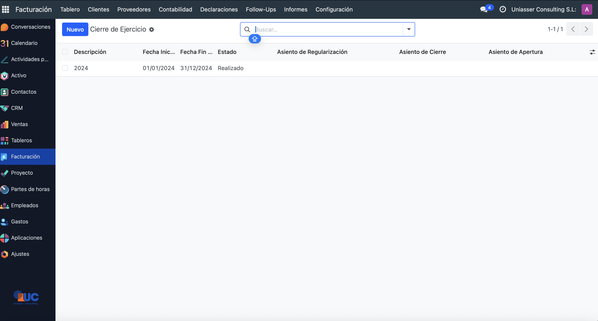
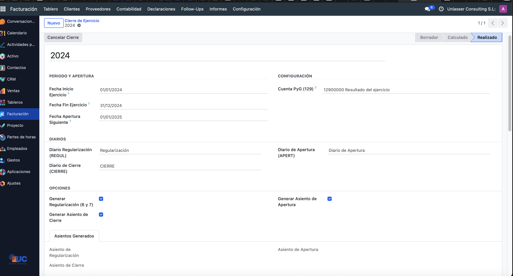
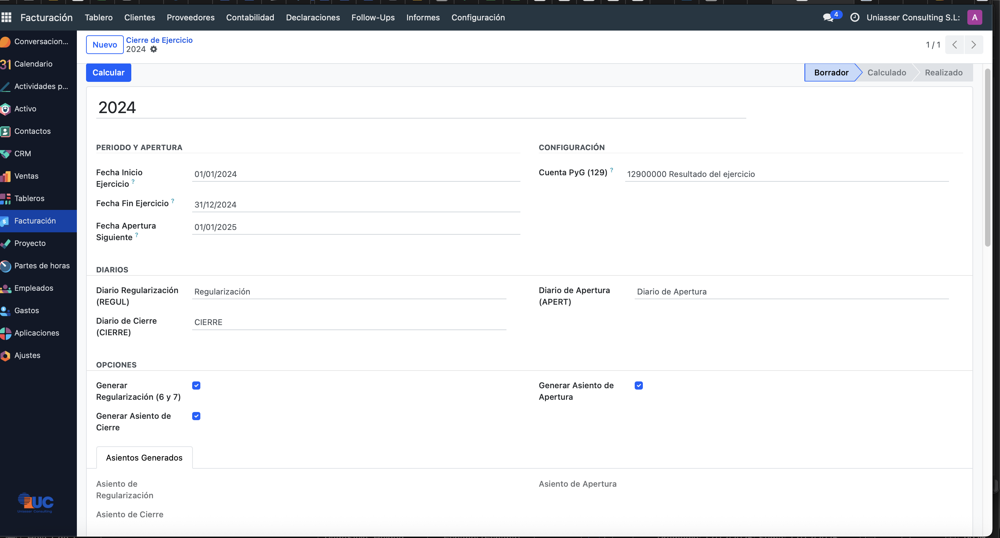
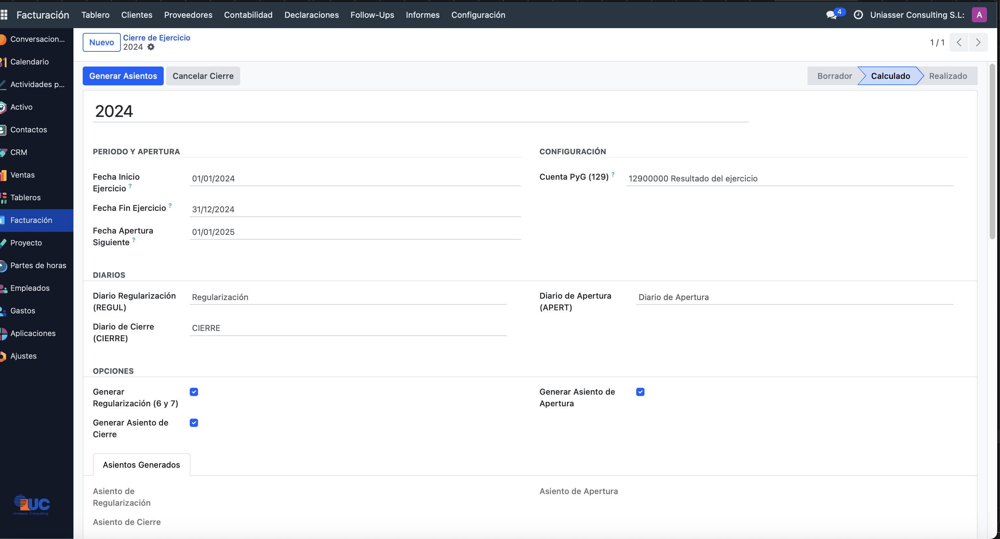
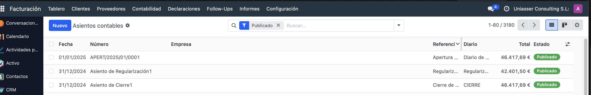
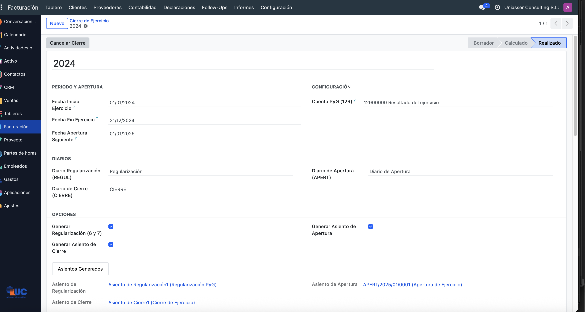

# 📘 Guía de Usuario - Cierre de Ejercicio Fiscal España

## 📦 Instalación del Módulo

### Requisitos Previos

**Versión de Odoo**: 18.0 o superior

**Dependencias del módulo**:
- `base` - Módulo base de Odoo (instalado por defecto)
- `account` - Módulo de Contabilidad (instalado por defecto)
- `mail` - Sistema de mensajería (instalado por defecto)

**Plan Contable**:
- Debe tener instalado el Plan General Contable Español (módulo `l10n_es`)
- La cuenta **129 (Resultado del Ejercicio)** debe existir en su plan contable

### Pasos de Instalación

1. **Acceder al menú de Aplicaciones**
   - Ir a `Aplicaciones` en el menú principal de Odoo
   - Actualizar la lista de aplicaciones si es necesario

2. **Buscar e instalar el módulo**
   - Buscar: `Spanish Fiscal Year Closing` o `l10n_es_fiscal_year_closing`
   - Hacer clic en **Instalar**

3. **Verificación automática**
   - El módulo creará automáticamente los siguientes diarios si no existen:
     - **REGUL** - Diario de Regularización
     - **CIERRE** - Diario de Cierre
     - **APERT** - Diario de Apertura
   - Todos son diarios de tipo "General"

> ✅ **Nota**: No es necesario crear manualmente los diarios. El módulo los crea automáticamente durante la instalación para cada compañía.

---

## 🚀 Cómo Utilizar el Módulo

### Paso 1: Acceder al Módulo

1. Ir a **Contabilidad** en el menú principal
2. Seleccionar **Asientos Contables** > **Cierre de Ejercicio**
3. Hacer clic en **Crear** para iniciar un nuevo cierre

---

### Paso 2: Configurar el Cierre del Ejercicio

**Campos a completar**:

#### Información General
- **Descripción**: Nombre identificativo del cierre (ej: "Cierre 2024", "Cierre Ejercicio 2025")

#### Periodo y Apertura
- **Fecha Inicio Ejercicio**: Primer día del año fiscal a cerrar (ej: 01/01/2024)
- **Fecha Fin Ejercicio**: Último día del año fiscal (ej: 31/12/2024)
  - Esta será la fecha de los asientos de regularización y cierre
- **Fecha Apertura Siguiente**: Primer día del ejercicio siguiente (ej: 01/01/2025)
  - Esta será la fecha del asiento de apertura

#### Configuración
- **Cuenta PyG**: Seleccionar la cuenta **129 - Resultado del Ejercicio**
  - Esta cuenta debe existir en su plan contable

#### Diarios
El módulo muestra los tres diarios necesarios:
- **Diario Regularización (REGUL)**: Para el asiento de PyG
- **Diario de Cierre (CIERRE)**: Para el asiento de cierre del balance
- **Diario de Apertura (APERT)**: Para el asiento de apertura

> ✅ **Importante**: Estos diarios se crean automáticamente al instalar el módulo. Si no aparecen, verifique que el módulo se instaló correctamente.

#### Opciones
Marcar las opciones deseadas:
- ✅ **Crear Asiento de Regularización**: Regulariza cuentas de grupos 6 y 7
- ✅ **Crear Asiento de Cierre**: Cierra todas las cuentas del balance
- ✅ **Crear Asiento de Apertura**: Abre el nuevo ejercicio

---

### Paso 3: Calcular el Cierre

1. Una vez configurados todos los parámetros, hacer clic en **Calcular**
2. El sistema validará:
   - Que las fechas son correctas
   - Que existen cuentas de los grupos 6 y 7
   - Que existe la cuenta 129
   - **Que todos los asientos del ejercicio están validados** ⚠️

> ⚠️ **IMPORTANTE**: El proceso NO funcionará si hay asientos en borrador en el ejercicio a cerrar. Todos los asientos del periodo deben estar validados antes de calcular el cierre.

3. Si todo es correcto, el estado cambiará a **Calculado**

---

### Paso 4: Generar los Asientos de Cierre

1. Hacer clic en el botón **Generar Asientos**
2. El sistema creará automáticamente:

   **a) Asiento de Regularización (Diario REGUL)**
   - Fecha: Fecha fin de ejercicio
   - Salda todas las cuentas de grupos 6 (Gastos) y 7 (Ingresos)
   - Contrapartida en cuenta 129 (Resultado del Ejercicio)
   - Se valida automáticamente

   **b) Asiento de Cierre (Diario CIERRE)**
   - Fecha: Fecha fin de ejercicio
   - Salda todas las cuentas del balance (grupos 1-5 y cuenta 129)
   - Deja todas las cuentas a saldo cero
   - Se valida automáticamente

   **c) Asiento de Apertura (Diario APERT)**
   - Fecha: Fecha de apertura del nuevo ejercicio
   - Es el inverso exacto del asiento de cierre
   - Restablece los saldos del balance en el nuevo ejercicio
   - Se valida automáticamente

3. El estado cambiará a **Realizado**

---

### Paso 5: Verificar los Asientos Generados

En la pestaña **Asientos Generados** podrá ver:
- **Asiento de Regularización**: Enlace directo al asiento creado
- **Asiento de Cierre**: Enlace directo al asiento creado
- **Asiento de Apertura**: Enlace directo al asiento creado

Puede hacer clic en cualquiera de ellos para revisar los detalles contables.

---

### Paso 6: Cancelar el Cierre (Si es necesario)

**El proceso es totalmente reversible**:

1. Hacer clic en el botón **Cancelar Cierre**
2. Confirmar la acción
3. El sistema:
   - Eliminará los tres asientos generados
   - Volverá el estado a **Borrador**
   - Permitirá volver a configurar y ejecutar el cierre

> ✅ **Ventaja**: Puede cancelar y volver a crear el cierre tantas veces como necesite hasta que esté satisfecho con el resultado.

---

## ⚠️ NOTA IMPORTANTE: Configuración de Informes

### Exclusión de Diarios en Informes MIS y Contables

**CRÍTICO**: Después de realizar el cierre, debe configurar sus informes para excluir los diarios de cierre, de lo contrario los saldos aparecerán a cero.

#### ¿Por qué?
Los asientos de cierre y regularización saldan todas las cuentas. Si incluye estos diarios en sus informes del ejercicio cerrado, todos los saldos aparecerán a cero.

#### Solución: Excluir Diarios en Informes

**Para Informes MIS (si usa el módulo MIS Builder)**:

1. Ir a **Contabilidad** > **Informes** > **MIS Reports**
2. Editar su informe MIS
3. En la configuración del informe, añadir reglas de exclusión:
   - **Excluir diario**: REGUL
   - **Excluir diario**: CIERRE
4. Guardar los cambios

**Para Informes Estándar de Contabilidad**:

1. Al generar cualquier informe contable (Balance, PyG, etc.)
2. Usar los filtros avanzados
3. En **Diarios**, deseleccionar:
   - REGUL (Regularización)
   - CIERRE (Cierre)
4. Mantener seleccionado APERT (Apertura) si desea ver el balance inicial del nuevo ejercicio

#### Resumen de Diarios por Informe

| Informe | REGUL | CIERRE | APERT | Otros Diarios |
|---------|-------|--------|-------|---------------|
| **Ejercicio Cerrado** | ❌ Excluir | ❌ Excluir | ❌ Excluir | ✅ Incluir |
| **Nuevo Ejercicio** | ❌ Excluir | ❌ Excluir | ✅ Incluir | ✅ Incluir |
| **Balance Inicial Nuevo Ejercicio** | ❌ Excluir | ❌ Excluir | ✅ Solo este | ❌ Excluir |

---

## 📋 Checklist Pre-Cierre

Antes de ejecutar el cierre, verifique:

- [ ] Todos los asientos del ejercicio están **validados** (no hay borradores)
- [ ] Las conciliaciones bancarias están completas
- [ ] Los asientos de ajuste están registrados
- [ ] La cuenta 129 existe en el plan contable
- [ ] Los diarios REGUL, CIERRE y APERT existen (creados automáticamente)
- [ ] Ha realizado una **copia de seguridad** de la base de datos

---

## ❓ Preguntas Frecuentes

### ¿Qué pasa si tengo asientos en borrador?
El proceso de cálculo fallará. Debe validar todos los asientos del ejercicio antes de calcular el cierre.

### ¿Puedo modificar los asientos generados?
No es recomendable. Si necesita hacer cambios, cancele el cierre, ajuste los asientos del ejercicio y vuelva a ejecutar el proceso.

### ¿Qué hago si me equivoco?
Simplemente cancele el cierre y vuelva a crearlo. El proceso es totalmente reversible.

### ¿Funciona en multi-compañía?
Sí, cada compañía tiene sus propios diarios y puede realizar su cierre independientemente.

### ¿Qué cuentas se regularizan?
- **Grupo 6**: Todas las cuentas de gastos
- **Grupo 7**: Todas las cuentas de ingresos
- **Contrapartida**: Cuenta 129 (Resultado del Ejercicio)

### ¿Qué cuentas se cierran?
- **Grupos 1-5**: Todas las cuentas del balance (Activo, Pasivo, Patrimonio Neto)
- **Cuenta 129**: Resultado del Ejercicio

### ¿Los diarios se crean automáticamente?
Sí, al instalar el módulo se crean automáticamente los tres diarios necesarios (REGUL, CIERRE, APERT) para cada compañía.

---

## 🔄 Adaptación a Otras Versiones de Odoo

Este módulo está desarrollado para **Odoo 18.0**.

**¿Necesita este módulo para otra versión de Odoo?**

Bajo petición, podemos adaptar este módulo a:
- ✅ Odoo 16.0
- ✅ Odoo 17.0
- ✅ Odoo 19.0

La adaptación mantiene todas las funcionalidades y características del módulo.

**Contacto para adaptaciones**:
- Email: info@uniasser.com
- WhatsApp: +34 722 77 40 75
- Website: https://www.uniasser.com

---

## 🆘 Soporte Profesional

### Canales de Contacto

- **📧 Email**: info@uniasser.com
- **📱 WhatsApp**: +34 722 77 40 75
- **🌐 Website**: https://www.uniasser.com

### Tiempo de Respuesta

- **⚡ Generalmente**: Menos de 2 horas
- **🕐 Máximo garantizado**: 24 horas

Soporte para instalación, configuración y dudas técnicas del módulo.

### Información Adicional

- **Precio**: 79,00 EUR + IVA
- **Facturación**: Factura completa con desglose de IVA
- **Vendedor**: Uniasser Consulting S.L. (CIF: ESB12331039)
- **Domicilio**: C/ Ausiàs March, 11. 12540 Vila-real (Castellón), España
- **Documentación**: Consulte el archivo README.rst incluido

---

## 📝 Resumen del Proceso

1. **Preparación**: Validar todos los asientos del ejercicio
2. **Crear**: Nuevo cierre desde Contabilidad > Cierre de Ejercicio
3. **Configurar**: Fechas, diarios y opciones
4. **Calcular**: Validar la configuración
5. **Generar**: Crear los tres asientos automáticamente
6. **Verificar**: Revisar los asientos generados
7. **Configurar Informes**: Excluir diarios REGUL y CIERRE de informes

**¡El cierre de ejercicio nunca fue tan fácil!** 🎉

---

**Versión del módulo**: 18.0.1.0.0  
**Última actualización**: Marzo 2026
